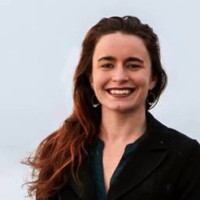
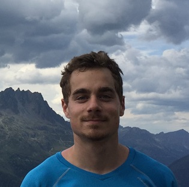
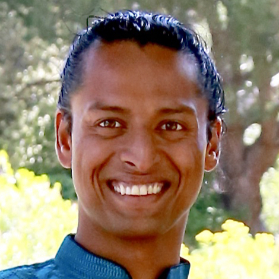
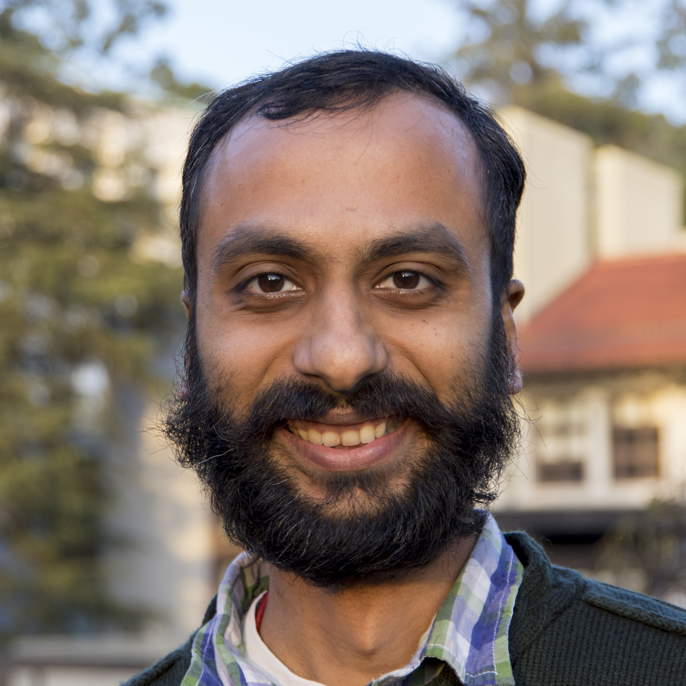
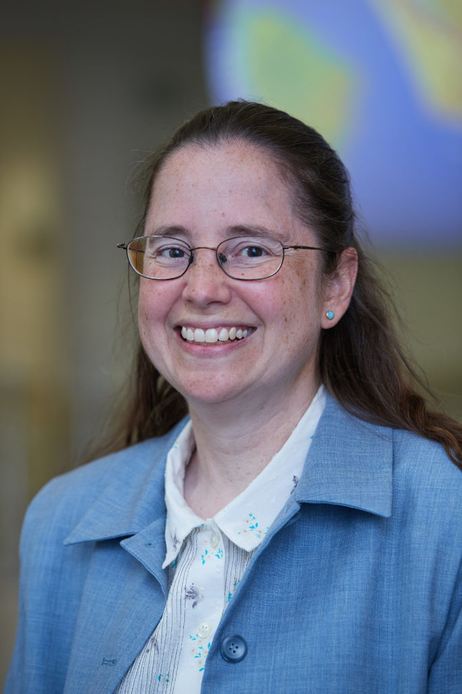

# Organizers

## Core Team 

[S. Karthik Mukkavilli](https://www.linkedin.com/in/karthikmukkavilli/), Workshop Chair, [@DrMukkavilli](https://twitter.com/DrMukkavilli)  
Project Scientist US DOE Exascale Computing, UC Irvine; Research Affiliate - Berkeley Lab, McGill 

---

  

[Johanna Hansen](https://johannah.github.io) [@johanbanan](https://twitter.com/johanbanan)  
PhD Candidate at McGill, School of Computer Science, Mobile Robotics Lab 

---

  

[Kelly Kochanski](https://www.kochanski.org/kelly/)  
Computational Science Graduate Fellow, CU Boulder, Core Team - Climate Change AI    

---

  

[Natasha Dudek](https://www.linkedin.com/in/natasha-dudek/)  
Postdoc at McGill - Mila, Deep Learning in Bioinformatics   

---

  

[Tom Beucler](http://tbeucler.scripts.mit.edu/tbeucler/)  
Project Scientist, Atmospheric Science, UC Irvine and Columbia University 

---

  

[Karthik Kashinath](https://www.nersc.gov/about/nersc-staff/data-analytics-services/karthik-kashinath/)  
Climate Informacist and AI Scientist, NERSC and Berkeley Lab    

---  

  

[Mayur Mudigonda](https://mudigonda.github.io/)  
Head of AI, Terrafuse; Research Affiliate, Berkeley Lab   

---  

  

[Amy McGovern](http://www.mcgovern-fagg.org/amy/) [@profamymcgovern](https://twitter.com/profamymcgovern)  
Presidential Prof. in Computer Science and Adjunct Prof. in Meteorology, University of Oklahoma     

---   

## Steering Committee
[Aaron Courville](https://mila.quebec/en/person/aaron-courville/), Professor at Mila and Université de Montréal  
[Gregory Dudek](http://www.cim.mcgill.ca/~dudek/), Chaired Professor at McGill in Computer Science, VP Samsung AI Research, Montréal  
[Vipin Kumar](https://www-users.cs.umn.edu/~kumar001/), Chaired Professor at Minnesota in Computer Science and Engineering    
[Pierre Gentine](https://eee.columbia.edu/faculty/pierre-gentine), Associate Professor of Earth and Environmental Engineering, Columbia University    
[Mary C. Hill](https://geo.ku.edu/hill-mary-c), Professor of Geology at University of Kansas    
[Paul D. Miller, aka DJ Spooky](http://djspooky.com/), Artist in Residence at Google, National Geographic Emerging Explorer  
[Trooper Sanders](https://twitter.com/troopersanders?lang=en), CEO at Benefits Data Trust     
[Chad Frischmann](https://www.drawdown.org/staff/chad-frischmann), VP & Research Director at Drawdown    
[Daniel M. Kammen](https://en.wikipedia.org/wiki/Daniel_Kammen), Distinguished Professor, Energy and Resources Group, UC Berkeley 

[back](./)
